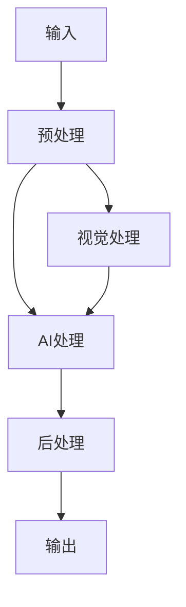
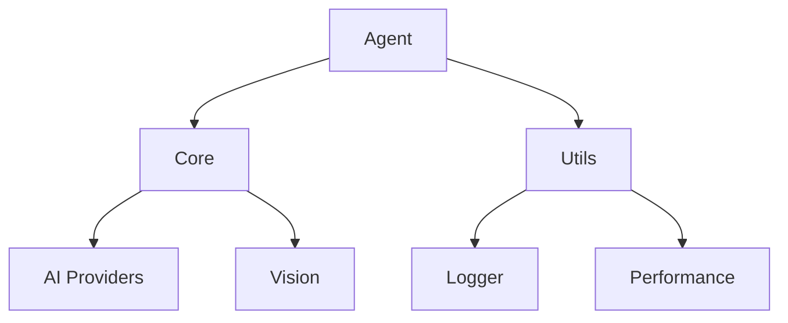

# JsonSage AI Agent 架构概览

## 系统架构

JsonSage AI Agent 采用模块化设计，主要包含以下核心组件：

### 1. 核心层 (Core Layer)

#### 1.1 JSON处理器 (JSON Processor)
- JSON解析和验证
- 类型推断
- 模式生成
- 错误处理

#### 1.2 AI引擎 (AI Engine)
- 多AI提供者支持
  - DeepSeek
  - SmolVLM
- 模型管理
- 推理优化

#### 1.3 视觉处理器 (Vision Processor)
- 图像预处理
- 视觉分析
- JSON-视觉映射

### 2. 工具层 (Utility Layer)

#### 2.1 日志系统 (Logging System)
- 错误日志
- 性能日志
- 操作日志

#### 2.2 性能监控 (Performance Monitoring)
- 处理时间跟踪
- 资源使用监控
- 性能报告生成

#### 2.3 配置管理 (Configuration Management)
- 环境配置
- API密钥管理
- 模型参数设置

### 3. 接口层 (Interface Layer)

#### 3.1 API接口 (API Interface)
- REST API
- WebSocket支持
- 事件系统

#### 3.2 CLI工具 (CLI Tools)
- 命令行工具
- 批处理支持
- 自动化脚本

### 4. 扩展层 (Extension Layer)

#### 4.1 插件系统 (Plugin System)
- 自定义处理器
- 中间件支持
- 事件钩子

#### 4.2 集成接口 (Integration Interface)
- IDE插件
- 第三方工具集成
- API网关

## 数据流

## 模块依赖

## 扩展性设计

### 1. 提供者扩展
- 支持添加新的AI提供者
- 自定义处理逻辑
- 模型适配器

### 2. 处理器扩展
- 自定义预处理
- 自定义后处理
- 中间件支持

### 3. 输出格式扩展
- 自定义输出格式
- 多格式转换
- 模板支持

## 安全考虑

### 1. 数据安全
- 输入验证
- 数据加密
- 访问控制

### 2. API安全
- 认证机制
- 速率限制
- 日志审计

### 3. 配置安全
- 密钥管理
- 环境隔离
- 权限控制

## 性能优化

### 1. 缓存策略
- 结果缓存
- 模型缓存
- 配置缓存

### 2. 并发处理
- 任务队列
- 并发控制
- 资源管理

### 3. 资源优化
- 内存管理
- CPU使用优化
- 网络优化

## 后续规划

### 1. 短期目标
- 完善测试覆盖
- 优化性能
- 增加文档

### 2. 中期目标
- 添加新功能
- 提升稳定性
- 社区建设

### 3. 长期目标
- 生态系统建设
- 企业级功能
- 云服务支持
